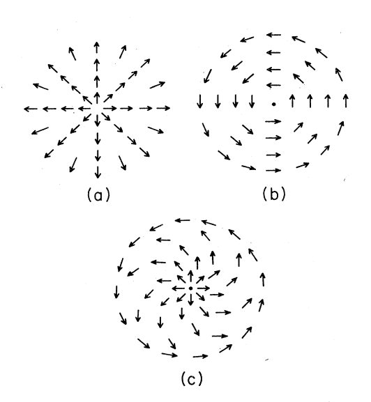

# 1. Motivation

## 1.2. Vortex with continuous order parameter space  
### 1.2.1. Capture non-trivial info
  
Field $\phi: X\rightarrow F$  
Where base space $X=R^2$     
and order parameter space  $F=S^1\cup\{0\}$  
$0$ is for a vortex core.  

### 1.2.2. Topological protection
### 1.2.3. Bulk-Boundary correspendence

## 1.1. Vortex with discrete order parameter space
### 1.1.1. Manifold vs Graph
### 1.1.2. Fractional charge

# 2. Formalism
## 2.1. Domain wall network
### 2.1.1. Domain wall network(DWN)
$$D:=(P,\Phi,c)$$
where $P$ is a *base graph*, mathematically plane graph $(V,E,F)$.  
We'll use Bourbaki's definition of graph about $V,E$ and  
here, $F$ is a face cycles defined in clock-wise order.  
$f = \langle e_1,e_2,\cdots,e_n\rangle$ where $\langle \rangle$ is a cyclically ordered sequence.  
$V,E,F$  are called  *domains, domain walls, domin vortices*   respectively.  
$\Phi$ is a *order parameter set*, mathematically set,  
$c$ is a *coloring*, mathematically function $c:V(P)\rightarrow \Phi$ whose incidence is differnet.
### 2.1.2. Symmetry breaking,  Degenerate ground states, Phase
#### 2.1.2.1. Symmetry breaking
$$G_{broken}<G_{origin}$$
#### 2.1.2.2. Degenerate ground states
$$\Phi= G_{origin}/G_{broken}$$
#### 2.1.2.3. Phase
If $G_{broken}\lhd G_{origin}$, then $\Phi$ is a group and called *phase group*. and for domain $v\in V(P)$, $c(v)\in \Phi$ is called *phase of domain*.  

### 2.1.3. Phase domain wall network(pDWN)
#### 2.1.3.1. Definition
Domain wall network $D$ is a pDWN if $\Phi$ is a phase group.
#### 2.1.3.2. Phase shift of domain wall
*shift map* is defined by
$$c_{dw}: E(P)\rightarrow \Phi \quad 
\phi \mapsto c(o(e))^{-1}*c(t(e))$$
$c_{dw}(e)$ is called *phase shift of domain wall* $e$.  
$c_{dw}(e)\neq1_{\Phi}$  
$c_{dw}(\bar{e})=\{c_{dw}(e)\}^{-1}$ 

#### 2.1.3.3. Phase loop of vortex
$$f\in F(P) \quad f=\langle e_1,e_2,\cdots,e_n\rangle$$
$$c_{vor}(f):=\langle c_{dw}(e_1),c_{dw}(e_2),\cdots,c_{dw}(e_n)\rangle$$
$c_{vor}(f)$ is called *phase loop of vortex* $f$.  
$c_{dw}(e_1)*c_{dw}(e_2)*\cdots*c_{dw}(e_n)=1_{\Phi}$

#### 2.1.3.4. Phase equivalence
If $c(v_1)=c(v_2)$, then two domains $v_1$,$v_2$ are called *phase equivalent*.  
If $c_{dw}(e_1)=c_{dw}(e_2)$, then two domain walls $e_1$,$e_2$ are called *phase equivalent*.   
If $c_{vor}(f_1)=c_{vor}(f_2)$, then two vortices $f_1$,$f_2$ are called *phase equivalent*. 

#### 2.1.3.5. Guage invariance
In electrodynamics, if we add a gauge transformation ($V \rightarrow V+V_0$) to the theory, the physical predictions($\overrightarrow{E} ,\rho$) should not change.  
Similarly, in pDWN $D=(P,\Phi,c)$, we can easily define new coloring $c'$ by $c'(v)=c(v)*\phi_0$ where $\phi_0\in \Phi$ then $D'=(P,\Phi,c')$ is also a pDWN. $c_{dw}$ and $c_{vor}$ are invariant under this transformation.

### 2.1.4. Boundary decomposition
#### Path
#### Boundary
## 2.2. Order parameter space
### 2.2.1. degenerate ground states
### 2.2.2. possible dw
### 2.2.3. possible vor
### 2.2.4. order parameter space

ion
# 3. Examples
## 3.1. $Z_2\times Z_2 $
### 3.1.1. all dw
#### 3.1.1.1. vortex, anti-vortex, abab-vortex *
### 3.1.2. 01,10 dw
#### 3.1.2.1. abab vortex
## 3.2. $Z_2\times Z_2\times Z_2$
## 3.3. $Z_3\times Z_3$
### 3.3.1. $z_{12}, z_{23}$

